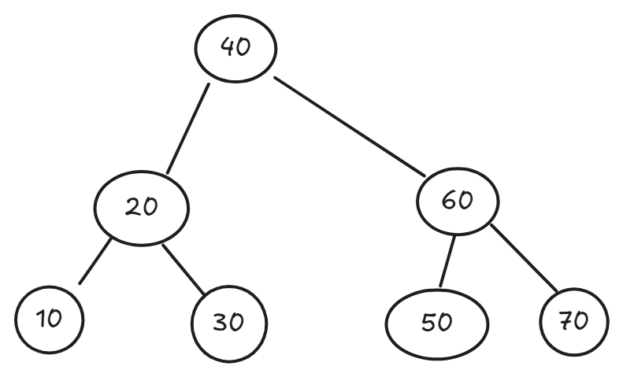

Spomnimo se definicije razreda BST, ki predstavlja vozlišče dvojiškega drevesa:

Python
class BST:
    def __init__(self, key):
        self.key = key
        self.left = None
        self.right = None
Kot delovni primer vzemimo spodnje dvojiško iskalno drevo:

1. Naloga (Priprava podatkov)
V kalupu imate podano funkcijo tree_from_list(lst), ki iz urejenega seznama elementov zgradi uravnoteženo dvojiško iskalno drevo. Kakšen seznam morate podati tej funkciji, da dobite točno tako drevo, kot je opisano v delovnem primeru?

1. Naloga (Pregled in filtriranje)
Napišite funkcijo hide_div4(self), ki izpiše vse elemente drevesa v vrstnem redu in-order. Če je vrednost ključa deljiva s 4, namesto števila izpišite samo znak *. Elementi naj bodo v izpisu ločeni s presledkom.

Primer: Za drevo iz delovnega primera bi bil izpis:
10 * 30 * 50 * 70

2. Naloga (Pregled glede na položaj)
Napišite funkcijo hide_left(self), ki izpiše vse elemente drevesa v vrstnem redu in-order. Če pa se število nahaja v levem poddrevesu (gledano glede na koren celotnega drevesa), namesto celega števila izpišite niz L_X, kjer je X prva števka (na mestu desetic ali stotic) tega števila. Koren in elementi v desnem poddrevesu se izpišejo normalno.

Primer: Za drevo iz delovnega primera bi bil izpis:
L_1 L_2 L_3 40 50 60 70

3. Naloga (Operacije po nivojih)
Napišite funkcijo count_level(self, level), ki vrne število (prešteje koliko jih je) elementov v drevesu, ki se nahajajo na natanko določeni globini level. Koren drevesa se nahaja na globini 0.

Primer: Za drevo iz delovnega primera klici vrnejo:

count_level(0) vrne 1 (samo koren 40)

count_level(1) vrne 2 (vozlišči 20 in 60)

count_level(2) vrne 4 (listi 10, 30, 50, 70)

count_level(3) vrne 0