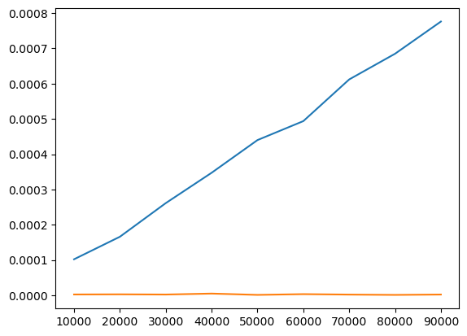

# Urejanje I
## Uroš Čibej
### 26.2. 2025

---
# Ponovimo 

- pri predmetu se bomo lotili predvsem vprašanj o **učinkovitosti** algoritmov
- empirično smo definirali nekaj "škatel" kamor bomo shranjevali algoritme ($n$-velikost problema, iščemo odvisnost izvajalnega časa od $n$)
  - $O(n)$ - linearna odvisnost od velikosti problema
  - $O(\lg(n))$ - logaritemska odvisnost
  - $O(1)$ - neodvisnost od velikost problema

---

# Iskanje

- najprej se bomo lotili problemov v zaporednih podatkih (tabelah)
- zahtevnost iskanja (kot smo narisali zadnjič)

- spodnja črta je zahtevnost iskanja podatka v urejenih podatkih
---

# Zakaj urejanje?

- praktični aspekti
  - lažje iskanje (kot smo na prejšnji prosojnici omenili)
  - osnova za marsikateri algoritem (če ne veš kako rešiti problem, najprej uredi)
- didaktični aspekti
  - enostaven problem za opis in razumevanje
  - izjemno bogastvo algoritmov
  - veliko različnih željenih lastnosti algoritmov (nekaj o tem pozneje)

---

# Predpostavke o urejanju

- imamo neko urejenost podatkov $\leq$
  - števila
  - nizi
  - ... neka druga totalna urejenost
- edino kar vemo o podatkih je, da za vsak par podatkov
$$(p_1,p_2): p_1\leq p_2 \vee p_2\leq p_1$$


---

# Urejanje s štetjem (naiven, neuporaben alg.)
- predpostavimo, da so vsi elementi v tabeli različni
- za vsak element tabele $a$ ugotovimo kje je v urejeni tabeli, če preštejemo koliko elementov je $<$

$$urejena[k] = a[i], k=|\{x| x<a[i]\}|$$

Preizkusimo na primeru:
$$17,12,15,28,23,7,19,2,44,33,11$$

---
# Inverzije

V tabeli $a$ dva elementa na pozicijah $i$ in $j$ tvorita inverzijo, če velja $i<j$ in $a[i]>a[j]$.

Preštejmo inverzije:
$$17,12,15,28,23,7,19,2,44,33,11$$

- Koliko je lahko najmanj inverzij v tabeli?
- Koliko je lahko največ inverzij tabeli?

---
# Matematični intermezzo

**Izrek.** Če imamo nekje v tabeli inverzijo, potem gotovo obstajata dva zaporedna elementa, ki tudi tvorita inverzijo.

A bi znali to dokazati?

---
# Urejanje z zamenjavami

**Ideja**
  - zamenjujemo sosednje inverzije, dokler jih ni več

Preizkusimo na primeru:
$$17,12,15,28,23,7,19,2,44,33,11$$
---
# Implementacija (zamenjave)

```python
def bubble_sort(a):
	n = len(a)
	for i in range(n-1):
		for j in range(n-1):
			if a[j]>a[j+1]:
				a[j], a[j+1] = a[j+1],a[j]
	return a
```
---
#  Zanke in vsote

$$\sum_{i=0}^{n-1}{\sum_{j=0}^{n-1}{1}}=?$$

---
# Urejanje z izbiranjem


**Ideja**
  - v neurejenem dela najdemo najmanjši element
  - z njim podaljšamo urejeni del (zamenjamo z ?)

Preizkusimo na primeru:
$$17,12,15,28,23,7,19,2,44,33,11$$

---
# Implementacija (izbiranje)

```python
def select_sort(a):
	n = len(a)
	for i in range(n-1):
		m = i
		for j in range(i+1,n):
			if a[j]<a[m]:
				m = j
		  a[i], a[m] = a[m],a[i]
```
---

# Zanke in vsote
$$\sum_{i=0}^{n-1}{\sum_{j=i+1}^{n-1}{1}}=?$$
---

# Urejanje z vstavljanjem


**Ideja**
  - element ? vrinemo na pravo mesto v urejeni del
  - z tem podaljšamo urejeni del za en element


Preizkusimo na primeru:
$$17,12,15,28,23,7,19,2,44,33,11$$

---
# Implementacija (vstavljanje)

```python
def insert_sort(arr):
	n = len(arr)
	for i in range(1,n):
		j = i
		while j>0 and arr[j]<arr[j-1]:
			arr[j], arr[j-1] = arr[j-1],arr[j]
			j-=1
```
---

# Zanke in vsote

$$\sum_{i=0}^{n-1}{\sum_{j=i}^{x}{1}}=?$$

- koliko je $x$ v najboljšem primeru?
- koliko je $x$ v najslabšem primeru?
---
# Eksperimentirajmo


