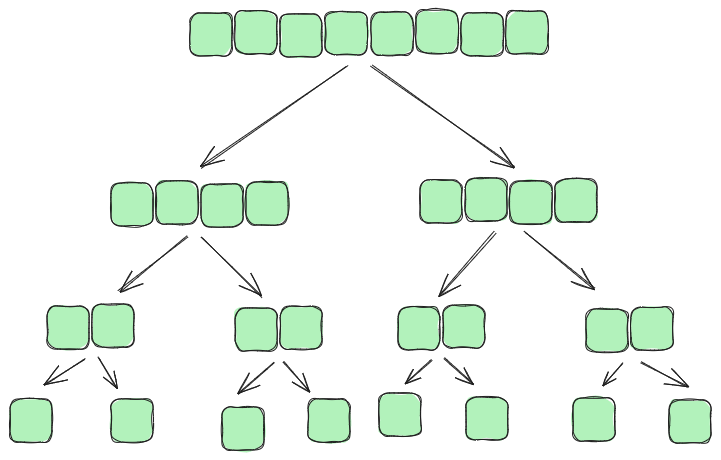
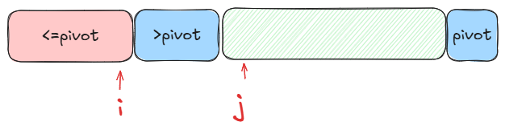

# Urejanje II
## Uroš Čibej
### 5.3. 2025

---
# Ponovimo 

- spoznali smo 3 (+1) algoritme za urejanje
- urejamo v $O(n^2)$
- empirično potrdili, da lahko urejamo tabele $n\approx 20000$

---

# Dve lastnosti urejanja

1. urejanje v istem prostoru
2. stabilnost

---

# Isti prostor

- razen par dodatnih spremenljivk, vse delamo v istem pomnilnku
- zgolj zamenjujemo vrednosti v tabeli (swap)
- vsi trije algoritmi uporabljajo isti prostor (razen tisti s štetjem)

---

# Stabilnost

- enaki elementi ohranijo pozicijo tudi po urejanju
- (1,8),(2,3),(2,5),(5,2),(1,3) uredimo po prvi komponenti
- **stabilno** : (1,8),(1,3),(2,3),(2,5),(5,2)
- **ne stabilno** : **(1,3),(1,8)**,(2,3),(2,5),(5,2)


---

#  Znani algoritmi

| algoritem  | Isti prostor | stabilnost |
|--------------------|:--------:|:--------:|
| zamenjave      | ✅       | ✅       |
| izbira    | ✅       | ❌       |
| vstavljanje   | ✅       | ✅       |

Zakaj selection sort ni stabilen?
Uredimo s selection sort: (1,8),(2,3),(2,5),(5,2),(1,3)

---
# (Naj)boljši algoritmi
Ogledali si bomo dva algoritma, ki izgledata takole:


1. zlivanje (mergesort)
	- **ločevanje*** je enostavno, **združevanje** zahteva več pozornosti
2. hitro urejanje (quicksort)
	- **ločevanje** je bolj zahtevno, **združevanje** je enostavno
---
# Zlivanje (združevanje za mergesort)

Začnemo z dvema urejenima tabelama, kako ju združiti v eno urejeno tabelo?


---
# Primer zlivanja
$$[2,6,9,15,33,48,49]$$
$$[7,8,10,17,22,34,38,52]$$


---
# Implementacija
```python
def merge(left, right):

    sorted_array = []
    i = j = 0
    # zlivanje
    while i < len(left) and j < len(right):
        if left[i] < right[j]:
            sorted_array.append(left[i])
            i += 1
        else:
            sorted_array.append(right[j])
            j += 1
	# TODO - kako prepisati še ostanek?

    return sorted_array
```
---
# Razbijanje


---
# Primer razbijanja
$$[28,5,17,22,10,8,22,45,29,6,33]$$


---
# Urejanje z zlivanjem 
```python
def merge_sort(a):
	n = len(a)
	if n <= 1:
		return a
	else:
		mid = n//2
		left = merge_sort(a[:mid])
		right = merge_sort(a[mid:])
		return merge(left,right)
```
---
# Hitro urejanje (zelo podobno urejanju z zlivanjem)
```python
def quick_sort(a):
	n = len(a)
	if n <= 1:
		return a
	else:
		pivot = a[0]
		less = [x for x in a if x < pivot]
		eq = [x for x in a if x == pivot]
		greater = [x for x in a if x > pivot]
		return quick_sort(less) + eq + quick_sort(greater)
```

---
#  Poraba časa

- pri enostavnih urejanjih smo rekli: zanka =$\Sigma$
- pri rekurzivnih programih imamo rekurzivno enačbo za porabo časa:
$$T(n) = 2T(n/2)+c$$
- obstaja tudi matematična metoda za reševanje takih enačb
- mi bomo do rezultata prišli bolj intuitivno

---
# Drevo izvajanja




---
# Razbijanje v istem prostoru

- oba predstavljena algoritma potrebujeta dodaten prostor
- zlivanja se praktično ne da implementirati "in-place"
- za razbijanje obstaja ogromno "in-place" algoritmov
    - mi si bomo ogledali Lomutovo metodo

---
# Razbijanje Lomuto

- zadnji element je pivot
- s for zanko (j) bodisi povečamo del (<=pivot>) ali pa pustimo element v delu >pivot



---
# Primer

$$[28,5,17,22,10,8,20,45,29,6,21]$$

---
# Implementacija (Lomuto razbijanje)

```python
# pozor - low in high sta indeksa prvega in zadnjega elementa 
def lomuto_partition(a, low, high):
    pivot = a[high]  # zadnji element naj bo pivot
    i = low - 1  # pozicija trenutno najmanjšega elementa
    
    for j in range(low, high):
        if arr[j] <= pivot:
            i += 1
            arr[i], arr[j] = arr[j], arr[i]  # 
    
    # Premik pivota na pravo mesto
    arr[i + 1], arr[high] = arr[high], arr[i + 1]  
    return i + 1
```
---

# Stabilnost Lomuta?

---
# Eksperimentirajmo


