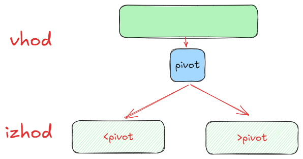

# Urejanje II
## Uroš Čibej
### 5.3. 2025

---
# Ponovimo 

- spoznali smo 3 (+1) algoritme za urejanje
- urejamo v $O(n^2)$
- empirično potrdili, da lahko urejamo tabele $n\approx 20000$

---

# Dve lastnosti urejanja

1. urejanje v istem prostoru
2. stabilnost

---

# Isti prostor

- razen par dodatnih spremenljivk, vse delamo v istem pomnilnku
- zgolj zamenjujemo vrednosti v tabeli (swap)
- vsi trije algoritmi uporabljajo isti prostor (razen tisti s štetjem)

---

# Stabilnost

- enaki elementi ohranijo pozicijo tudi po urejanju
- (1,8),(2,3),(2,5),(5,2),(1,3) uredimo po prvi komponenti
- **stabilno** : (1,8),(1,3),(2,3),(2,5),(5,2)
- **ne stabilno** : **(1,3),(1,8)**,(2,3),(2,5),(5,2)


---

#  Znani algoritmi

| algoritem  | Isti prostor | stabilnost |
|--------------------|:--------:|:--------:|
| zamenjave      | ✅       | ✅       |
| izbira    | ✅       | ❌       |
| vstavljanje   | ✅       | ✅       |

Zakaj selection sort ni stabilen?
Uredimo s selection sort: (1,8),(2,3),(2,5),(5,2),(1,3)

---
# (Naj)boljši algoritmi
Ogledali si bomo dva algoritma, ki izgledata takole:


1. zlivanje (mergesort)
	- **ločevanje*** je enostavno, **združevanje** zahteva več pozornosti
2. hitro urejanje (quicksort)
	- **ločevanje** je bolj zahtevno, **združevanje** je enostavno
---
# Zlivanje (združevanje za mergesort)

Začnemo z dvema urejenima tabelama, kako ju združiti v eno urejeno tabelo?


---
# Primer zlivanja
$$[2,6,9,15,33,48,49]$$
$$[7,8,10,17,22,34,38,52]$$


---
# Implementacija
```python
def merge(left, right):

    sorted_array = []
    i = j = 0
    # zlivanje
    while i < len(left) and j < len(right):
        if left[i] < right[j]:
            sorted_array.append(left[i])
            i += 1
        else:
            sorted_array.append(right[j])
            j += 1
	# TODO - kako prepisati še ostanek?

    return sorted_array
```
---
# Razbijanje


Izbira pivotnega elementa je ključna za enakomerno razbijanje

---
# Primer razbijanja
$$[28,5,17,22,10,8,22,45,29,6,33]$$

---
# Urejanje z zlivanjem


---
# Implementacija

---
#  Poraba časa

$$T(n) = 2T(n/2)+c$$

---
# Razbijanje v istem prostoru


---
# Implementacija (Lomuto partition)

```python
def lomuto_partition(a, low, high):
    pivot = a[high]  # zadnji element naj bo pivot
    i = low - 1  # pozicija trenutno najmanjšega elementa
    
    for j in range(low, high):
        if arr[j] <= pivot:
            i += 1
            arr[i], arr[j] = arr[j], arr[i]  # 
    
    arr[i + 1], arr[high] = arr[high], arr[i + 1]  # Premik pivota na pravo mesto
    return i + 1
```
---
# Primer

$$$$

---
# Stabilnost Lomuta?

---
# Eksperimentirajmo


