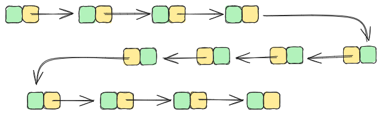
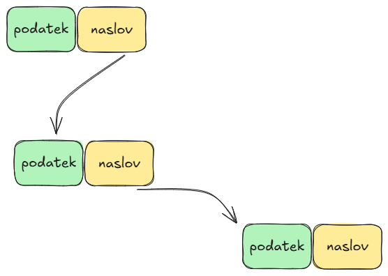
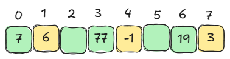
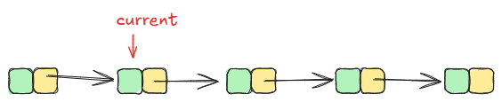
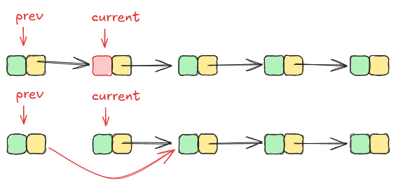

# Dinamične podatkovne strukture
## Uroš Čibej
### 12.3. 2025



---
# Ponovimo
- računalnik nam kot edino organizacijo podatkov ponuja tabele
- če so podatki znani vnaprej, statični:
    - znamo urediti podatke ($O(n\log{n})$)
    - znamo hitro iskati po urejenih podatkih ($O(\log{n})$) 
- Kaj se zgodi, če imamo bolj nepredvidljive scenarije in drugačne zahteve od podatkov?

---

# Dinamične podatkovne strukture
- Organizacija podatkov za učinkovito uporabo
- Uporaba je dinamična (podatki prihajajo in odhajajo)
- Osnovne strukture (implementirali bomo s tabelo): 
  - Sklad
  - Vrsta 
  - Množica 
- Povezan seznam

---

#  Sklad
- LIFO (Last In, First Out)
- Operaciji:
  - `push(x)`: postavi $x$ na sklad
  - `pop()`: odstrani zgornji element s sklada


---

# Implementacija s tabelo

```python
class Stack:
    def __init__(self, size=10):
        self.items = [None]*size
        self.top = -1
        self.size = size
```
---
```python

    def push(self, item):
        if self.top == self.size-1:
            print('Stack is full!')
            return
        self.top += 1
        self.items[self.top] = item
    
    def pop(self):
        if self.top == -1:
            print('Stack is empty!')
            return None
        item = self.items[self.top]
        self.top -= 1
        return item
```
---

# Primer uporabe sklada

Obratna poljska notacija (implementirajmo kalkulator)

---

# Vrsta (Queue)

- FIFO (First In, First Out)
- Operaciji:
  - `enqueue(x)`: vstavi $x$ na konec vrste
  - `dequeue()`: odstrani prvi element v vrsti
---

```python

class Queue:
    def __init__(self, size=10):
        self.items = [None]*size
        self.front = 0
        self.rear = 0
        self.size = size
```
---
```python

def enqueue(self, item):
        if (self.rear + 1) % self.size == self.front:
            print('Queue is full!')
            return
        self.items[self.rear] = item
        self.rear = (self.rear + 1) % self.size
```

---

```python

def dequeue(self):
    if self.front == self.rear:
        print('Queue is empty!')
        return None
    item = self.items[self.front]
    self.front = (self.front + 1) % self.size
    return item
```

---


#  Enostavna množica
- Lastnosti:
  - Unikatni elementi
- Operacije:
  - `add(x)`: doda $x$ v množico
  - `remove(x)`: odstrani $x$ iz množice
  - `contains(x)`: preveri, ali $x$ pripada množici
---
```python
class SetA:
    def __init__(self, universal_set):
        # uredimo zaradi hitrejšega iskanja
        self.universal_set = sorted(universal_set) 
        self.items = [False]*len(universal_set)
        self.size = len(universal_set)
```
---

```python
def add(self, item):
        index = binary_search(self.universal_set, item)
        if index != -1 :
            self.items[index] = True

def remove(self, item):
    index = binary_search(self.universal_set, item)
    if index != -1 :
        self.items[index] = False

def contains(self, item):
        index = binary_search(self.universal_set, item)
        if index != -1 :
            return self.items[index]
        return False
```
---
# Časovna zahtevnost operacij
- Sklad
    - push $O(1)$
    - pop $O(1)$
- Vrsta
    - enqueue $O(1)$
    - dequeue $O(1)$
- Množica
    - dodajanje, brisanje, pripadnost $O(log(M))$
---

# Problemi z delom s tabelo

- če imamo bolj nepredvidljive načine uporabe podatkov (predvsem brisanje)
- če želimo še vedno delati s tabelo:
    - neprestano premikamo velike količine podatkov
    - ali pustimo "luknje" v tabeli

- rešitev za "luknje" so povezani seznami

---

# Povezani seznami
- Prednosti:
  - Dinamična velikost
  - Hitro vstavljanje in brisanje
- Osnovna ideja:

- raztresene podatke povežemo v verige

---



---


---
# Implementacija

```python
class LinkedList:
    def __init__(self, value):
        self.value = value
        self.next = None
```

---


#  Iskanje v povezanem seznamu



```python
def search(self, x):
    current = self
    while current:
        if current.value == x:
            return True
        current = current.next
    return False
```

---

# Dodajanje v povezani seznam

```python
def insert(self, x):
    new_node = LinkedList(x)
    new_node.next = self
    return new_node
```

---

# Brisanje iz povezanega seznama



---

```python
def delete(self, x):
    current = self
    prev = None
    while current:
        if current.value == x:
            if prev:
                prev.next = current.next
                return self
            else:
                return current.next
        prev, current = current, current.next
    return self 
```
---


# Dodatne uporabne operacije nad seznami 

implementiramo na vajah, če zmanjka časa

```python
def search_recursive(self, x)

def delete_recursive(self, x)

def append(self, x)

def concat(self, other)

def reverse(self)
```

