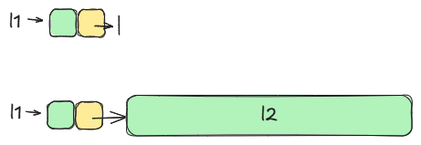
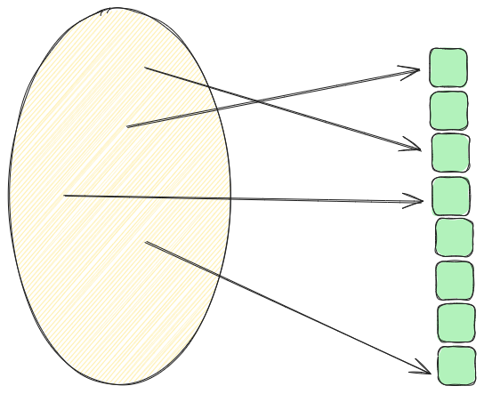

# Seznami in razpršene tabele
## Uroš Čibej
### 19.3. 2025


--- 
# Ponovimo
- spoznali smo štiri enostavne dinamične podatkovne strukture
    - sklad
    - vrsta
    - množica
    - povezan seznam
- v aplikacijah izbiramo tisto, ki nam najbolj učinkovito reši problem

---
# Cilji za danes

1. rekurzivno reševanje problemov v seznamih
2. razpršene tabele

---
# Rekurzivno delo s povezanimi seznami

- vse operacije do sedaj smo definirali z zankami
- seznami so struktura, kjer je veliko operacij "naravno" rekurzivnih
- rekurzivno delo in razstavljanje problemov pogosto olajša delo

---
# Intermezzo - $\mathbb{N}$ in indukcija

* $1\in \mathbb{N}$
* $n\in \mathbb{N}\implies n+1\in \mathbb{N}$

---
Vsota prvih n lihih števil je
$$n^2$$

Dokažimo!

---
#  $\mathbb{N}$  in seznami

* seznam z enim elementom je seznam
* če je $l2$ seznam $\implies$ če dodam element na začetek tega seznama, dobim seznam



---
# Način reševanja problemov s seznami

1. znam rešiti problem na seznamu z enim elementom
2. če predpostavim, da znam rešiti problem na $l_2$, kako rešiti problem v seznamu z enim elementom več?

---
# Dolžina seznama

- če poznam dolžino "repa", kako izračunam dolžino celotnega seznama?

--
```python
    def length(self):
        if self.next == None:
            return 1
        return 1 + self.next.length()
```

---
# Pomnožimo vse elemente s konstanto
```python
    def mult(self, k):
        self.item *= k
        if self.next == None:
            return 
        self.next.mult(k)
```

---
# Vsota vseh elementov
(kodiramo)

---
# Rekurzivno dodajanje (na konec)
(kodiramo)

---
# Pripenjanje (konkatenacija)
(kodiramo)

---
# Obrat seznama
(kodiramo)

---
# Razpršene tabele
- Če je univerzalna množica majhna $\to$ znamo s tabelo
- Ogromne univerzalne množice $\to$ nimamo dovolj pomnilnika
 


---
# Vsak podatek je lahko "število"

- podatke zakodiramo kot število, ali vzamemo njihovo računalniško predstavitev, ki je že število
- nizi znakov so že številka, če vzamemo njihovo ASCII kodiranje
$aab \to $


---
# Funkcije razprševanja

$$f:A\to B$$
- $A$ je ogromna množica ključev
- $B$ majhna množica indeksov table
- zaželjene lastnosti take funkcije:
    - hitra
    - deterministična (vsakič isti rezultat pri istem vhodu)
    - enakomerno razprši ključe po množici $B$

---
# Metoda deljenja

$$f(k) = k \mod M$$

$M$ je velikost tabele

---
# Primer
- imejmo tabelo velikosti 31
- preslikajmo niz $tabulator$

---
# Metoda množenja
$$f(k) = \lfloor M (kA \mod 1) \rfloor$$


\text{kjer so:}

- $ A $ je neka konstanta med 0 in 1 npr., $ A = \frac{\sqrt{5} - 1}{2} $,
- $ M $ velikost tabele,
- $ kA \mod 1 $  izlušči del za decimalko $ kA $.
---
# Primer
- imejmo tabelo velikosti 31
- preslikajmo niz $namrgoden$

---
# Razreševanje trkov
- ker je $$|A|<<|B|$$ pride do trkov pri preslikovanju (dva ključa se preslikata v isti indeks)
- oglejmo si dva načina kako to razrešimo:
    - odprto naslavljanje
    - veriženj

---
# Odprto naslavljanje

- poleg tabele nimamo drugih podatkov
- če naletimo na že zasedeno celico tabele, poiščemo novo celico po neke pravilu
- mi si bomo ogledali eno samo pravilo
    $$index = index + 1$$

---
# Veriženje
- vsaka celica vsebuje seznam
- nov ključ se preprosto doda temu seznamu

--- 

# Implementacija (odprto naslavljanje)
```python
class HashTableOpen:
    def __init__(self, table_size, hash_function):
        self.table_size = table_size
        self.hash_function = hash_function
        self.table = [None] * table_size
```
---
```python
def insert(self, key, value):
        index = self.hash_function(key, self.table_size)
        while self.table[index] is not None:
            index = (index + 1) % self.table_size
        self.table[index] = key, value 
```

---
```python
def get(self, key):
        index = self.hash_function(key, self.table_size)   
        while self.table[index] is not None:
            k, v = self.table[index]
            if k == key:
                return v
            index = (index + 1) % self.table_size
        return None 
```

---
# Implementacija (veriženje)
(uporabljamo kar sezname od pythona)
```python
class HashTableChaining:
    def __init__(self, table_size, hash_function):
        self.table_size = table_size
        self.hash_function = hash_function
        self.table = [[] for _ in range(table_size)]
```
---
```python
def insert(self, key, value):
        index = self.hash_function(key, self.table_size)
        self.table[index].append((key, value))
  
```
---
```python
def get(self, key):
        index = self.hash_function(key, self.table_size)
        for i in range(len(self.table[index])):
            k,v = self.table[index][i]
            if  k == key:
                return v
        return None  
```