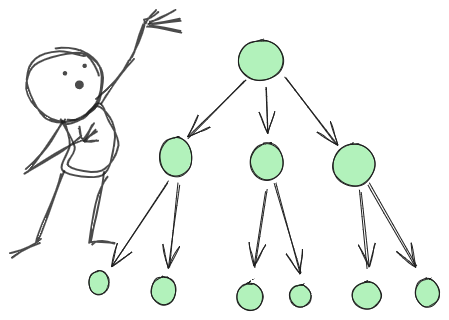
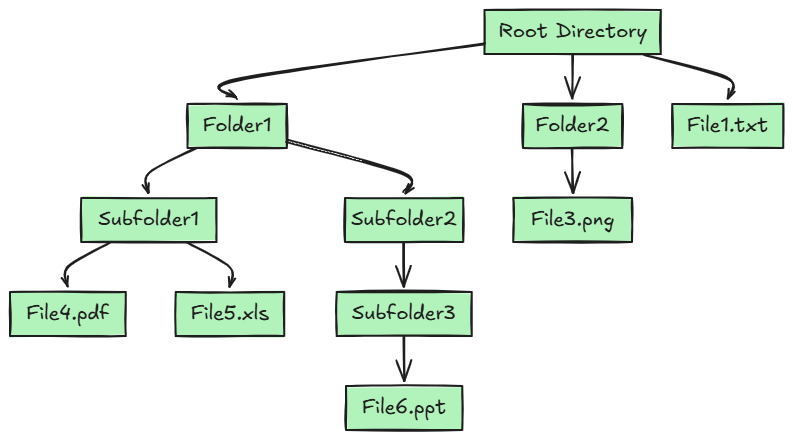
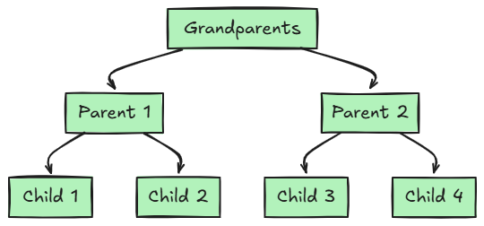
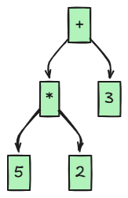
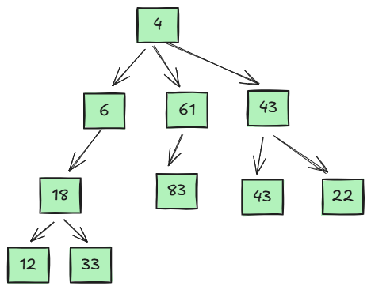
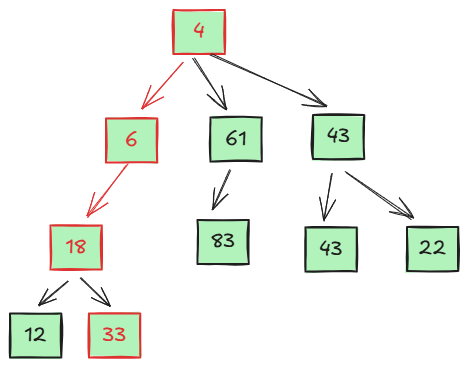
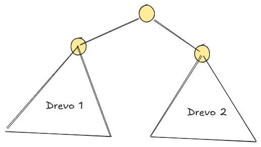

# Drevesa
## Uroš Čibej
### 26.3. 2025



--- 
# Ponovimo
- povezani seznami
- rekurzivne definicije podatkovnih struktur
- slabost: operacije zahtevajo sprehod skozi celoten seznam

---
# Cilji za danes

1. osnovni pojmi dreves
2. uporaba
3. obhodi

--- 
# Primeri dreves

Organizacijski diagrami

--- 
# Primeri dreves

Datotečni sistem

--- 
# Primeri dreves

Družinsko drevo

--- 
# Primeri dreves

Drevo aritmetičnega izraza


---
# (dolgočasne definicije)


- ukoreninjeno drevo
- vozlišča (nosijo nek podatek)
    - vrste vozlišč: koren, notranje, list
- povezava (starš, otrok)
-  odnosi med vozlišči: starš, otrok, potomec, prednik, sorojenec

---
# Poti


- zaporedje sosednih vozlišč in povezav
- dolžina poti je število povezav na poti
- tipično nas zanimajo poti od korena do listov


---
# Stopnje

* stopnja vozlišča - število potomcev
* stopnja drevesa - največje število potomcev nekega vozlišča (k-tiška drevesa)


---
# Višine, globine

* globina vozlišča - dolžina poti od korena do tega vozlišča
* višina drevesa - največja dolžina poti od korena do nekega lista

---
# Posebni vrsti dreves

* polna k-tiška drevesa: vsa notranja vozlišča imajo vse sinove
* popolna k-tiška drevesa: polna k-tiška drevesa, ki imajo vse poti od korena do listov enako dolga

---
# Matematične lastnosti dreves

* Koliko listov ima popolno dvojiško drevo z višino n?
* Koliko vozlišč (vseh) ima popolno dvojiško drevo z višino n?
* Kakšno višino ima popolno dvojiško drevo z n vozlišči?

---
#  Predstavitve dreves
- drevo je rekurzivna struktura

---
# Implementacija

```python
class TreeNode:
    def __init__(self, data, children):
        self.data = data
        self.children = children #seznam otrok
```


---
# Primer - datoteke in mape

```python
class FSNode:
    def __init__(self, name, is_dir=False, children=None):
        self.name = name
        self.is_dir = is_dir
        self.children = children if is_dir else []
        if is_dir and children is None:
            self.children = []
```

---
# Enostavne operacije
- višina drevesa
- preštevanje vozlišč
- preštevanje listov

---
# Enostavni sprehodi po drevesih

- pre-order
- post-order


