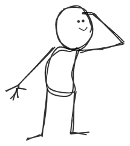
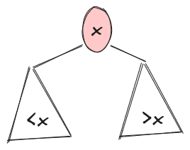
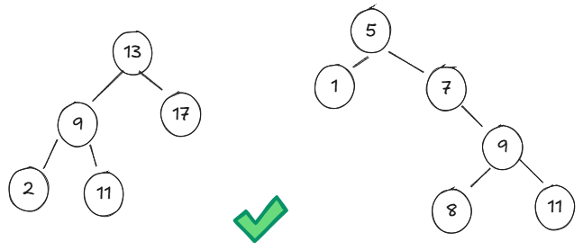
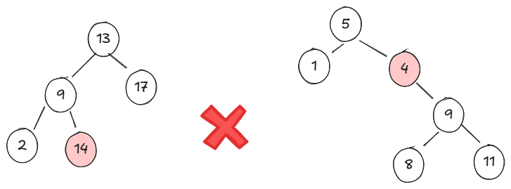
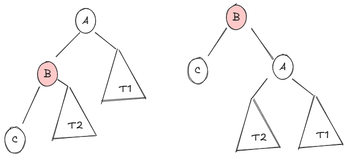
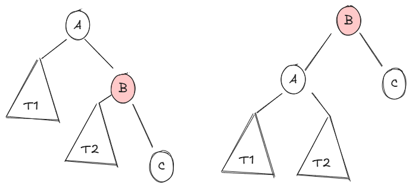
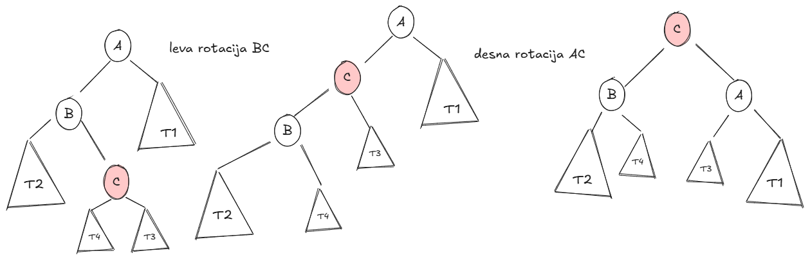
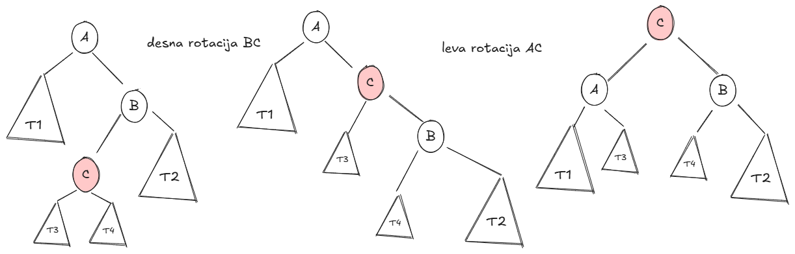

# Iskalna drevesa in uravnotežanje

## Uroš Čibej
### 2.4. 2025


-----
# Ponovimo
- vpeljali smo statična drevesa
- popolna drevesa so zelo "plitka" (majhna višina v primerjavi s količino podatkov)
- to lastnost bomo izkoristili za iskanje
---
# Pregled 

 - Dvojiška iskalna drevesa (BST)
    - osnovne operacije
    - experimenti
- Drevesa AVL
  - rotacije
  - osnovne operacije
  - ćeEksperimenti


-----

# Dvojiška iskalna drevesa

- v korenu hranimo ključ $x$
- v levem poddrevesu vse ključe $<x$
- v desnem poddrevesu vse ključe $>x$
- obe poddrevesi sta dvojiško iskalno drevo


-----
# Primeri


-----
# Primeri



---
# Osnovne operacije

* Iskanje
* Vstavljanje
* Iskanje minimuma
* Brisanje
* Obhodi

---
# Implementacija

```python
class BST:
    def __init__(self, key):
        self.key = key
        self.left = None
        self.right = None

```
-----

# Iskanje v BST

```python
def search(self, key):
    if self.key == key:
        return self
    if key < self.key:
        return self.left(key)
    return self.right(key)
```
---
# Dodajanje v BST
```python
def insert(self, key):
    if key < self.key:
        if self.left:
            self.left.insert(key)
        else:
            self.left = BST(key)
    elif key > self.key:
        if self.right:
            self.right.insert(key)
        else:
            self.right = BST(key)
    return self
```
---
# Minimum v drevesu
```python
def find_min(self):
    if self.left == None:
      return self.key
    return self.left.find_min()
```
---
# Brisanje iz BST
```python
def delete(self, key):
      # .... enako kot iskanje, ko pa najdemo element:
      else:  
          if self.left is None:
              return self.right  # Poveži starša z desnim otrokom
          elif self.right is None:
              return self.left  

          min_key = self._find_min(self.right)
          self.key = min_key  
          self.right = self.right.delete(min_key)  
          return self
```
---
# Obhodi
```python
def inorder(self):
  if self.left:
    self.left.inorder()
  print(self.key)
  if self.right:
    self.right.inorder()
```

-----

# Eksperimentirajmo


- če je dodajanje naključno
- če je dodajanje zlovoljno
- če je dodajanje nagnjeno naključno


-----

# Drevesa AVL 

-----

# Zakaj samouravnoteženost 

  * Problem izrojenih BST in njihov vpliv na zmogljivost.
  * Potreba po samouravnoteženih drevesih.
  * Pregled različnih vrst samouravnoteženih dreves (AVL, Rdeče-črna, lomljena drevesa, 2-3 drevesa, B-drevesa,...).

-----

# Drevesa AVL: Osnove 

  * **A**delson-**V**elskii in **L**andis (avtorja tega drevesa)
  * Dvojiška iskalna drevesa z zahtevo po ravnovesju 
  * Izračun faktorja ravnovesja za vozlišče $v$.
  $$balance(v)=v.left.height-v.right.height$$
  * Drevo AVL je tako drevo, kjer za vsako vozlišče $v$ velja:


$$ |balance(v)|\leq 1$$

---
# Primeri

-----

# Rotacije (potrebne za uravnotežanje)

  * Enostavne rotacije (leva in desna).
  * Dvojne rotacije (levo-desna in desno-leva).
  * Implementacija rotacijskih funkcij.


-----

# Desna rotacija



---

# Leva rotacija



---

# Leva-desna rotacija


---

# Desna-Leva rotacija



---
# Dodajanje
Kdaj detektiramo, če je potrebna rotacija?
$$|balance|>1$$

* $balance>1$ - levo poddrevo previsoko
  * $left.balance>0$ **desna rotacija**
  * $left.balance<0$ **leva-desna rotacija**
* $balance<-1$ - desno poddrevo previsoko
  * $right.balance<0$ **leva rotacija**
  * $right.balance>0$ **desna-leva rotacija**


---

# Implementacija (levo)

```python
def rotateL(self):
    t2 = self.right.left
    self.right.left = self
    new_root = self.right
    self.right = t2
    # popraviti višine!
    return new_root
```
---

# Implementacija (desno)

```python
def rotateR(self):
    t2 = self.left.right
    self.left.right = self
    new_root = self.left
    self.left = t2
    # popraviti višine!
    return new_root
```
---

# Implementacija (dodajanje)
- dodamo enako kot v navadnem BST
- po rekurzivnem dodajanju preverimo ravnovesje
- ko je levo drevo previsoko (desno je simetrično)
```python
if self.balance()>1:
    if self.left.balance()>0:
        return self.rotateR()
    else: # 
        self.left = self.left.rotateL()
        return self.rotateR()
```


---
# Eksperimentirajmo

