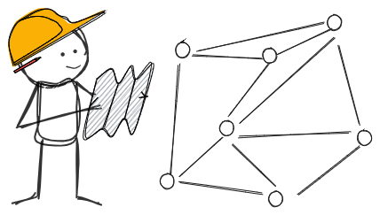
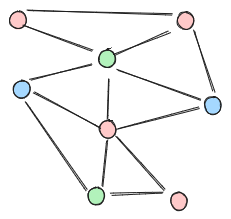
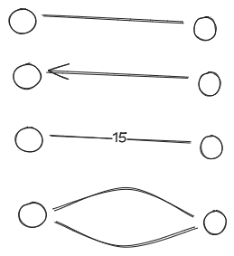
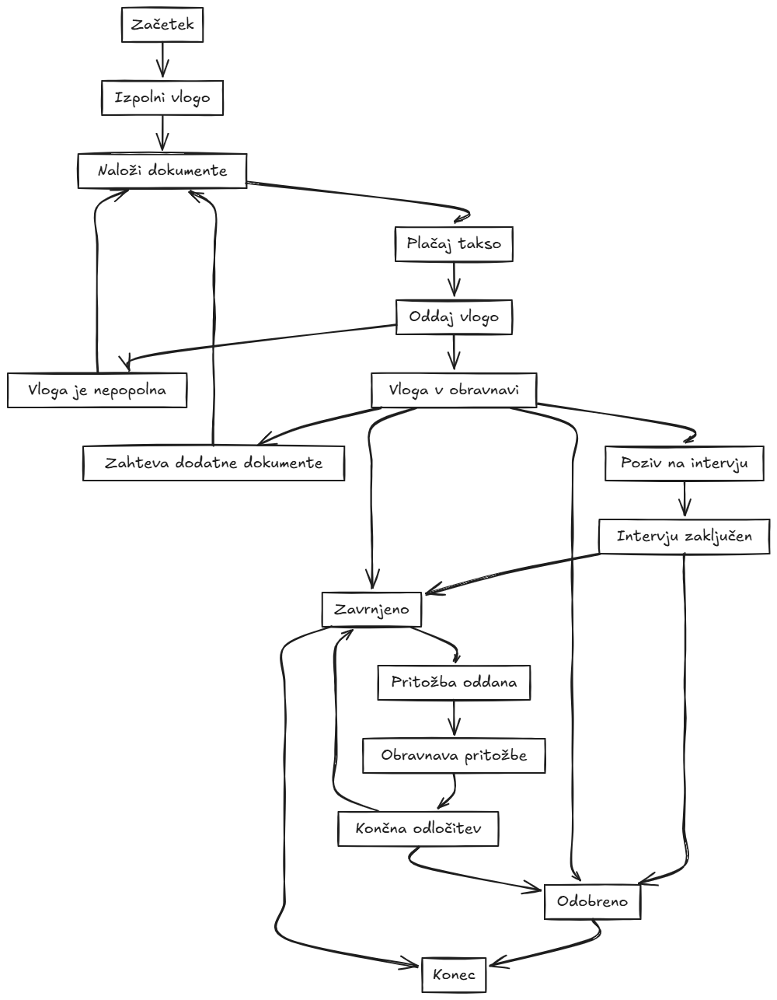
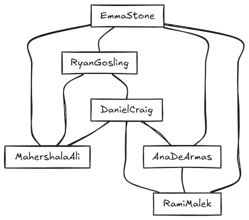
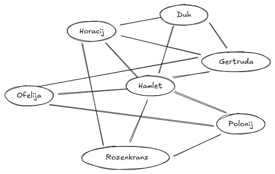
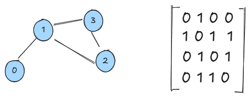
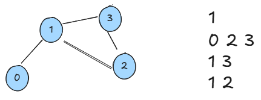
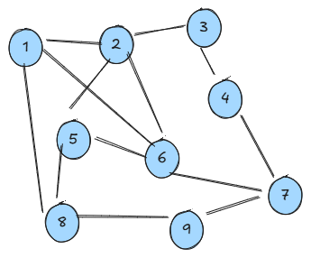

# Grafi (Osnove)

## Uroš Čibej
### 23.4. 2025


-----
# Ponovimo

- Podatki organizirani :
    - v tabele
    - povezane sezname
    - razpršene tabele
    - v drevesa
    - iskalna drevesa
    - samouravnotežena iskalna drevesa


---
# Pregled 

- osnovne definicije
- praktični primeri
- načini predstavitev
- obhodi

-----

# Grafi

- najbolj splošna organizacija podatkov
- vozlišča
- povezave
- omogočajo vpogled v strukturo 



-----

# Vrste grafov
- usmerjeni
- **neusmerjeni**
- uteženi
- multigrafi



----
# Osnovne definicije I

 $$G=\langle V, E\rangle$$
- $V$ - množica vozlišča
- $E$ - množica povezav
- usmerjen graf: $<u,v>\in E$ (urejeni pari)
-  neusmerjen graf $(u,v)\in E$ (neurejeni pari)
- neusmerjeni uteženi graf $((u,v),w)\in E$ (neurejeni pari z utežjo)
- multigraf: $E$ je večkratna množica

----
# Osnovne definicije II

- stopnja vozlišča
    - vhodna stopnja, izhodna stopnja
- pot 
- sprehod
- cikel
- povezan graf
- komponenta

----
# Primeri grafov 

- cestna omrežja
- socialna omrežja
- računalniška omrežja
- energetska omrežja

---
# Primeri grafov

- biološke mreže (npr. interakcije med proteini)
- omrežja literarnih junakov
- grafi besed
- grafi stanj igre


---
# Primer I



---
# Primer II



---
# Primer III




---
# Primer IV - Igra Nim

1. Začetek igre: na mizi je 15 vžigalic, dva igralca vlečeta izmenjaje poteze
2. Poteza : igralec vzame 1, 2 ali 3 vžigalice
3. Konec igre: zmaga kdor vzame z mize zadnjo vžigalico

Narišimo graf te igre


---
# Načini predstavitev

1. Matrika sosednosti
2. Seznami sosednosti

---
# Matrika sosednosti



---
# Seznami sosednosti


---
# Gostota grafa

1. Koliko je  lahko največ povezav v grafu z $n$ vozlišči?
2. Koliko je lahko najmanj povezav v grafu z $n$ vozlišči?
3. Koliko je lahko najmanj povezav v grafu z $n$ vozlišči in eno povezano komponento?

---
# Pri kateri gostoti se izplača katera predstavitev?

---
# Implementacija (matrika sosednosti)

```python
class GraphAM:
    def __init__(self, n):
        self.n = n
        self.matrix = [[False] * n for _ in range(n)]
```

---
# Implementacija (seznam sosednosti)

```python
class GraphAL:
    def __init__(self, n):
        self.n = n
        self.adj_list = [[] for _ in range(n)]
```


---
# Obhodi

- načini sistematične preiskovanja grafa
- že pri drevesih smo si ogledali načine za obhode
- graf nima posebnega začetka, obhod začnemo lahko kjerkoli

---
# Preiskovanje v globino

- začnemo v nekem vozlišču
- najprej obiščemo to vozlišče (označimo, da je obiskano)
- dokler obstaja neobiskani sosed
    - ga rekurzivno obiščemo

---
# Primer preiskovanja v globino




---
# Rekurzivna implementacija

```python
def dfs_rec(self, u, visited):
        if visited[u]:
            return
        visited[u] = True
        print(u, end=' ')
        for v in self.adj_list[u]:
            self.dfs_rec(v, visited) 
```
---
# Implementacija s skladom
```python
def dfs_stack(self, u):
    visited = [False] * self.n
    stack = [start]
    visited[start] = True

    while stack:
        u = stack.pop()
        print(u, end=' ')
        for v in self.adjacency_list[u]:
            if not visited[v]:
                visited[v] = True
                stack.append(v)
```
---
# Kako bi preverili, če je graf povezan?
