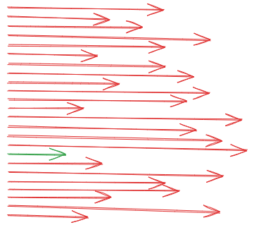
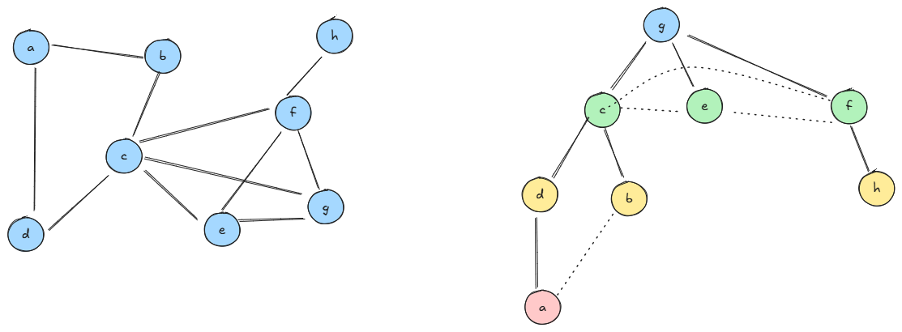
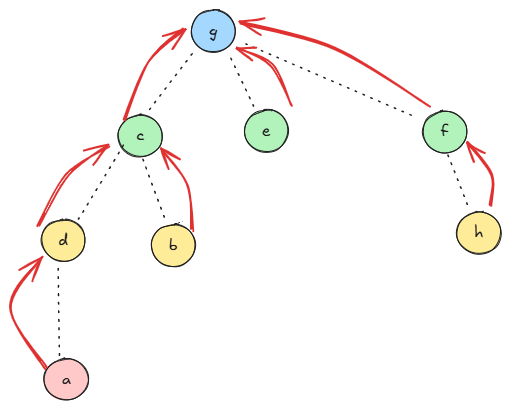
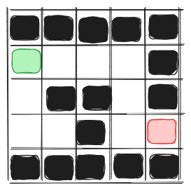
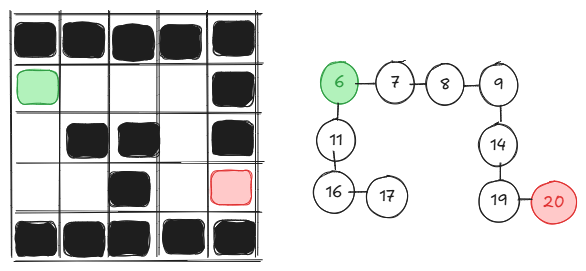
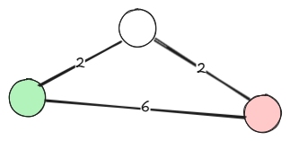
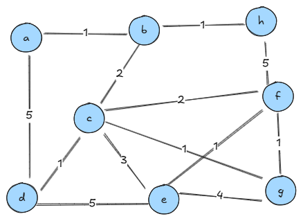
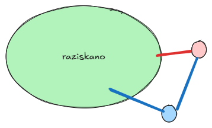

# Najkrajše poti v grafih

## Uroš Čibej
### 7.5. 2025


-----
# Ponovimo
- poznamo osnovne pojme grafov
- modelirati razne probleme z grafi
- predstaviti grafe v računalniku
- obhoditi graf (v globino)

---
# Pregled 

- problemi najkrajših poti
- praktični primeri
- najkrajše poti v neuteženih grafih
- primer: labirinti
- najkrajše poti v uteženih grafih


-----
# Vrste problemov najkrajših poti

- najkrajša pot med dvema vozliščema
- **najkrajša pot od začetnega vozlišča do vseh ostalih**
- najkrajša pot med vsemi pari vozlišč
- **v neuteženih grafih**
- **v uteženih grafih**

--- 
# Primeri uporabe

- navigacija v prostoru (GPS, roboti, logistika)
- usmerjanje podatkovnega prometa v internetu
- priporočilni sistemi v socialnih omrežjih
- planiranje/reševanje ugank

----
# Od enega do vseh ostalih
### neuteženi grafi

---
# Iskanje v širino (podobno kot pri drevesih)

- začnemo v začetnem vozlišču (damo ga v vrsto, označimo za obiskano)
- dokler vrsta ni prazna:
    - vzamemo vozlišče $u$ iz vrste
    - vse neobiskane sosede 
        - označimo za obiskane
        - damo v vrsto

---
# Primer



---
# Kako shranimo poti?



----
# Implementacija
```python
def bfs(self, start):
        visited = [False] * self.n
        paths = [None] * self.n
        paths[start] = -1
        queue = [start]
        visited[start] = True
        while queue:
            u = queue.pop(0)
            for v in self.adj_list[u]:
                if not visited[v]:
                    visited[v] = True
                    paths[v] = u
                    queue.append(v)
        return paths
```
---
# Časovna zahtevnost?
Pregledamo vse povezave:
$$O(m)$$
---
# Aplikacija - labirinti

```
#####
S   #
 ## #
  # E
#####
```


---
# Labirint v graf


---
# Uteženi grafi


- neuteženi grafi pogosto niso dovolj za modeliranje
- uteži na povezavah (razdalja, cena, strošek, ...)
- predpostavili bomo samo **pozitivne uteži**
- z BFS ne dobimo najkrajših razdalj (glej primer)

---
# Dijkstrov algoritem
- Edsger Dijkstra (nizozemski računalnikar)
- hiter, enostaven, široko uporaben algoritem

---
# Osnovna ideja
- obiskana (raziskana) vozlišča imajo že izračunano najkrajšo pot
- v vrsti so neobiskana vozlišča, skupaj z najkrajšo najdeno potjo
- dokler vrsta ni prazna
    - vzemi vozlišče z najkrajšo potjo iz vrste
    - dodaj vozlišče med obiskane
    - dodaj/popravi poti od tega vozlišča do vseh neobiskanih sosedov


---
# Primer


---
# Implementacija
```python
def dijkstra(self, start):
        visited = [False] * self.n
        dist = [float('inf')] * self.n
        dist[start] = 0
        queue = [start]
        paths = [None] * self.n
        paths[start] = -1
        while queue:
            u = min(queue, key=lambda x: dist[x])
            queue.remove(u)
            visited[u] = True
            for v, w in self.adj_list[u]:
                if not visited[v]:
                    if dist[u] + w < dist[v]:
                        dist[v] = dist[u] + w
                        paths[v] = u
                        if v not in queue:
                            queue.append(v)
        return dist, paths

```
---
# Zakaj to deluje?

- rdeča: najkrajša pot preko obiskanih
- modra: alternativna pot do rdečega ne more biti krajša


---
# Časovna zahtevnost
Naivna implementacija - v vsakem obiskanem vozlišču poiščemo minimum:

$$O(n^2)$$

---
# Izboljšava časovne zahtevnosti
Minimum lahko poiščemo v bolj kompleksni podatkovni strukturi (min kopica), za vsako posodobitev $\log{n}$

Skupaj:
$$m\log{n}$$


