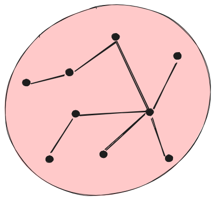
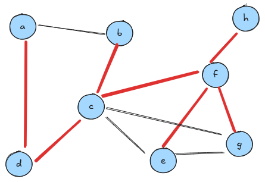
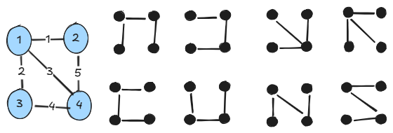
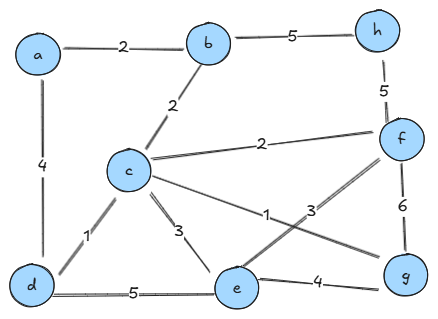
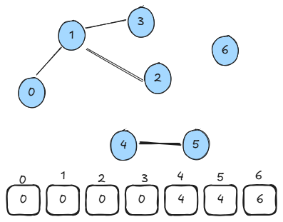
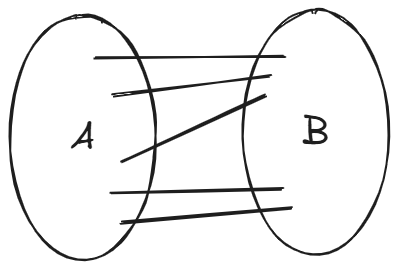
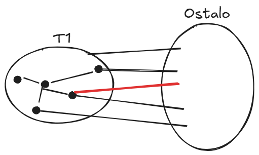
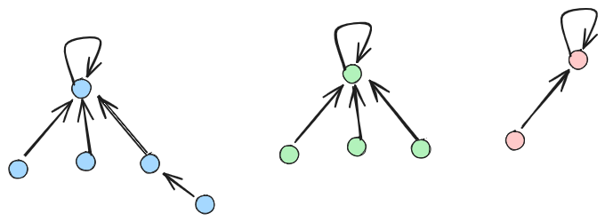
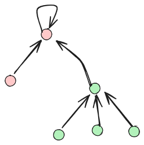
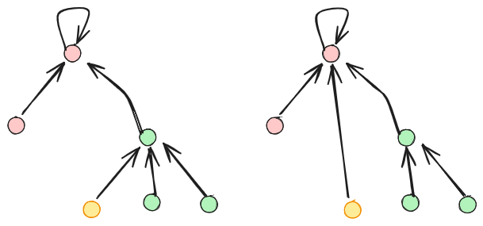

# Najcenejša vpeta drevesa

## Uroš Čibej
### 14.5. 2025


-----
# Ponovimo
- poznamo osnovne koncepte grafov
- obhode(DFS, BFS) 
- najkrajše poti v neuteženih grafih
- najkrajše poti v uteženih grafih

---
# Pregled 

- problem najcenejšega vpetega drevesa
- praktični primeri
- Kruskalov algoritem
- podatkovna struktura disjunktne množice (Union-find)
- problem trgovskega potnika*


-----
#  Vpeto drevo

 povezan podgraf brez ciklov, ki vključuje vsa vozlišča


---
# Koliko je vpetih dreves?


--- 
# Primeri uporabe

- načrtovanje omrežij
    - cestna omrežja
    - električna omrežja
    - računalniška omrežja
- gručenje podatkov (kateri podatki so si bolj "sorodni")
- analiza socialnih omrežij

---
# Kruskalov algoritem

- Joseph Kruskal (1956)
- požrešni algoritem (tudi Dijkstra je požrešen)
- v **ogromnem** prostoru vseh možnih vpetih dreves je izjemno učinkovit

---
# Osnovna ideja

- Povezave uredimo (naraščajoče) po utežeh v seznam $L$
- Vsako vozlišče je eno drevo $T_v$
- za vsako povezavo $(u,v)\in L$
    - če povezava ne tvori cikla
        - povežemo drevesi $T_u$ in $T_v$ v novo drevo

---
# Primer




---
# Kako zaznamo cikel?

obe krajišči povezave v istem drevesu

---


---
# Implementacija (disjunktne množice)
```python
class NaiveDisjointSets:
    class NaiveDisjointSets:
    def __init__(self, n):
        self.name = list(range(n))
    
    def union(self, u, v):
        # implementirajmo skupaj

```
---
# Implementacija (Kruskal)

```python
# uporaba naivnih disjunktnih množic
def kruskal_simple(self):
    ds = NaiveDisjointSets(self.n)
    edges = []
    for u in range(self.n):
        for v, w in self.adj_list[u]:
            if u < v:
                edges.append((w, u, v))
    edges.sort()
    mst = GraphWAL(self.n)
    for w, u, v in edges:
        if ds.name[u] != ds.name[v]:
            ds.union(u, v)
            mst.add_edge(u, v, w)
```
---
# Zakaj ta algoritem dela?

---
# Prerezi

Prerez določa razbitje množice vozlišč grafa v dve množici $A,B$
$$A\cup B = V, A\cap B = \emptyset$$ 
Prerez je množica povezav, ki potekajo od $A$ do $B$.




---
# Izrek
V vsakem prerezu je povezava z najmanjšo utežjo gotovo v najmanjšem vpetem drevesu

**Primer:**


---
# "Dokaz" pravilnosti 




---
# Časovna zahtevnost
```python
for w, u, v in edges:
        if ds.name[u] != ds.name[v]:
            ds.union(u, v)
            mst.add_edge(u, v, w)
```
$$O(mn)$$
----
# Podatkovna struktura disjunktne množice

- Kateri dve operaciji potrebujemo
    - preverjanje pripadnosti isti množici (**find**)
    - unija dveh množic (**union**)



---
# Unija


---
# Iskanje korena
Pri iskanju korena lahko premaknemo vozlišča bližje (zmanjševanje globine):


---
# Implementacija
```python
class UnionFind:
    def __init__(self, n):
        self.parent = list(range(n))

    def find(self, u):
        if self.parent[u] != u:
            self.parent[u] = self.find(self.parent[u]) 
        return self.parent[u]

    def union(self, u, v):
        root_u = self.find(u)
        root_v = self.find(v)
        if root_u != root_v:
            self.parent[root_u] = root_v
```
---
# Časovna zahtevnost?
Skoraj konstantna za unije množic:
$$O(1)$$

Kruskal s to tehniko postane:
$$O(m)$$


