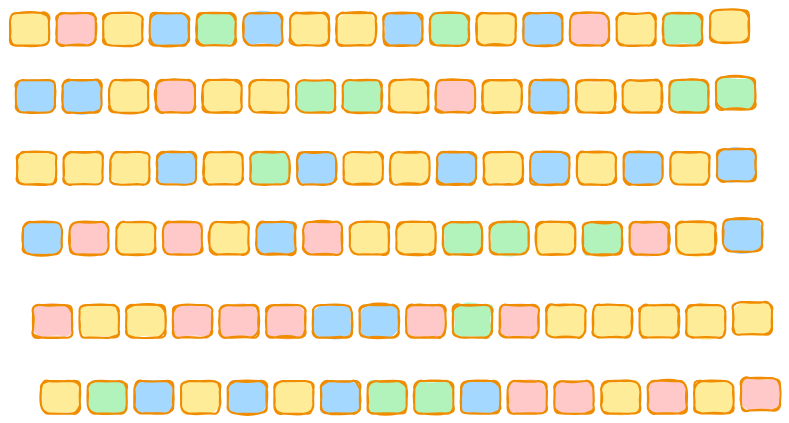
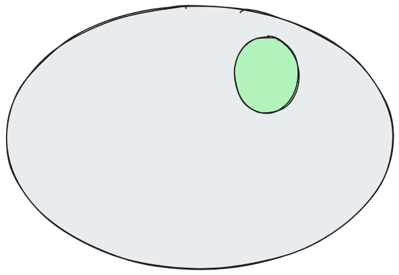
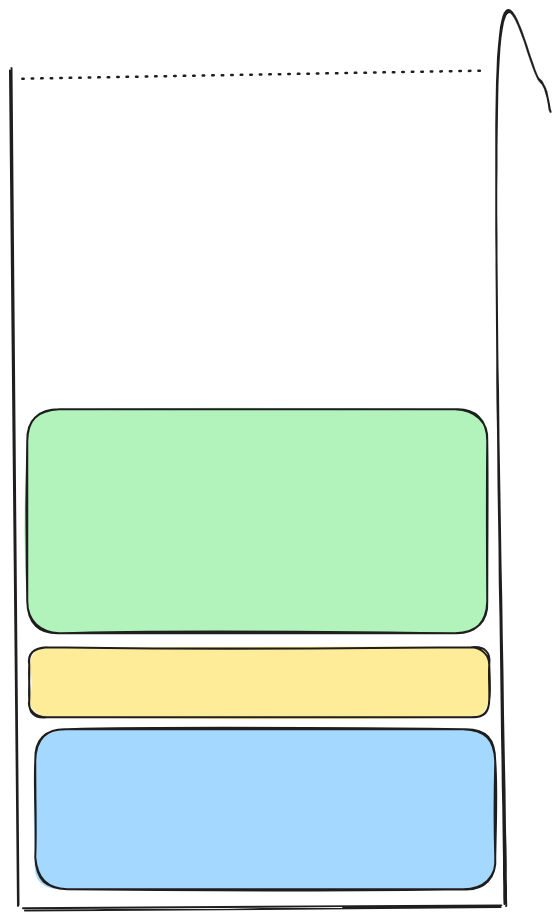
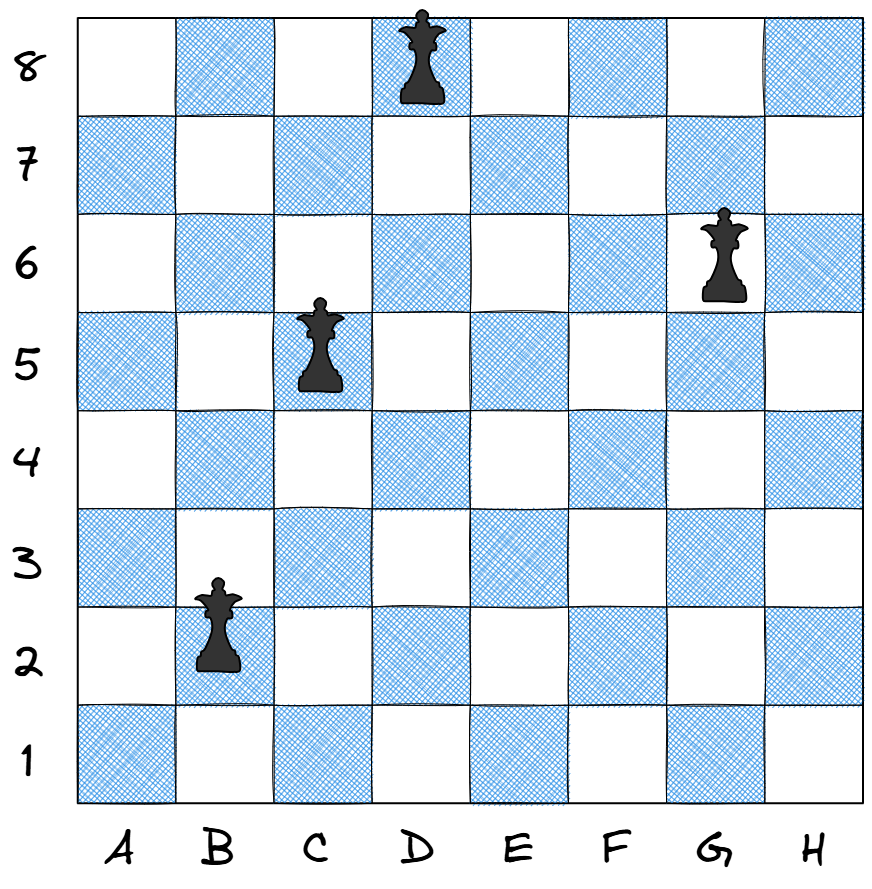

# Kombinatorika

## Uroš Čibej
### 21.5. 2025


---
# Pregled

- lahki : težki problemi
- $n$-terke
    - aplikacija (barvanje grafov)
- podmnožice
    - aplikacija (01-nahrbntik)
- permutacije
    - aplikacija ($n$ kraljic)

---
# Polinomsko : eksponentno

poglejmo si razlike!

---
# Osnovni kombinatorični objekti

- $n$-terke
- podmnožice
- permutacije

---
# Generiranje $n$-terk

$$n,k$$
**Primer:** $n=2, k=3$
(0,0),(0,1),(0,2),(1,0),(1,1),(1,2),(2,0),(2,1),(2,2)

---
# Generiranje z zankami
- za vsak $i$
    - za vsak $j$
        - za vsak $k$
            - ...
                - $(i,j,k,\ldots)$
---
# Rekurzivno generiranje

- 0-terka je samo ena $()$
- generiramo vse $n-1$ terke
- vsaki tej terki pripnemo vseh $k$ možnih vrednosti

---
# Generiranje s štetjem

- terke lahko obravnavamo kot števila v $k$-tiškem sistemu
- začnemo s terko $(0,0,0,\ldots)$ in prištevamo 1 $n^k-$krat


---
# Aplikacija (barvanje grafov)
V razredu imamo $n$-učencev. Vemo, kdo koga ne mara. Poskusimo narediti skupine, da v vsaki skupini noben nobenega ne sovraži.


---
# Primer
- Ana ne mara Jana, Tine in Urške.
- Blaž ne mara Maje in Petra.
- Cilka ne mara Ane in Tomaža.
- Jan ne mara Urške in Jerneja.
- Maja ne mara Blaža, Cilke in Ane.
- Nika ne mara Petra in Tine.
- Peter ne mara Jana in Nike.
- Tilen ne mara Maje, Nike in Tomaža.
- Tomaž ne mara Cilke, Petra in Jana.
- Urška ne mara Ane in Tine.

---
# Implementacija
Če znamo generirati $n$-terke, moramo implementirati zgolj preverjanje ali dana $n$-terka ustreza željenemu cilju.


---
# Generiranje podmnožic
$$A=\left\{a,b,c,d\right\}$$

$\emptyset, \{a\}, \{b\}, \{c\}, \{d\}, \{a,b\}, \{a,c\}, \{a,d\}, \{b,c\}, \{b,d\}, \{c,d\}, \{a,b,c\}, \{a,b,d\}$

$\{a,c,d\},\{b,c,d\}, \{a,b,c,d\}$


---
# Podmnožice so dvojiške $n$-terke


$$A=\left\{a,b,c,d\right\}$$
$B=\{a,d\}\ \longrightarrow 1001$ 


---
# Grayeva dvojiška koda
Posebno zaporedje, kjer se dve zaporedni $n$-terki razlikujeta zgolj na eni poziciji.

---
# Rekurzivna definicija 

$$G_1 = \{0,1\}$$

$$G_n = 0G_{n-1}+1$$

---
# Implementacija

```python
def gray_code(n):
    if n == 1:
        return [[0],[1]]
    else:
        g_smaller = gray_code(n - 1)
        result = []

        for code in g_smaller:
            result.append([0] + code)

        for code in reversed(g_smaller):
            result.append([1] + code)

        return result
```
---
# Aplikacija (01-nahrbtnik)

Podan je nahrbtnik s prostornino $V$. 

Oropati želimo trgovino, ki ima predmete
$\{(v_1, c_1),(v_2, c_2),\ldots(v_n, c_n),\}$

---
# Preverjanje

1. Izbrana podmnožica gre v nahrbnik
2. Vrednost je večja od  trenutno najmanjše

---
# Generiranje permutacij

$$1,2,3,4$$

1234	2134	3124	4123
1243	2143	3142	4132
1324	2314	3214	4213
1342	2341	3241	4231
1423	2413	3412	4312
1432	2431	3421	4321

---
# Ideja

- vsak element je lahko prvi
- nadaljevanje so vse permutacije ostalih elementov

To lahko neposredno zapišemo v rekuzivno definicijo

---
# Implementacija
```python
def permutations(l):
    if len(l) == 1:
        return [l]
    else:
        result = []
        for e in l:
            remaining = [x for x in l if x != e]
            for p in permutations(remaining):
                result.append([e] + p)
        return result
```

---
# Aplikacija (8 kraljic)



---
# Preverjanje

noben par kraljic ni v isti diagonali

---

# Implementacija
```python
def check_queens(perm):
    positions = list(enumerate(perm))  
    for i, j in positions:
        for k, l in positions:
            if i<k and (i+j == k+l or i-j == k-l):
                return False
    return True
```