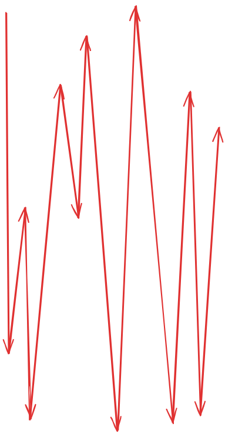
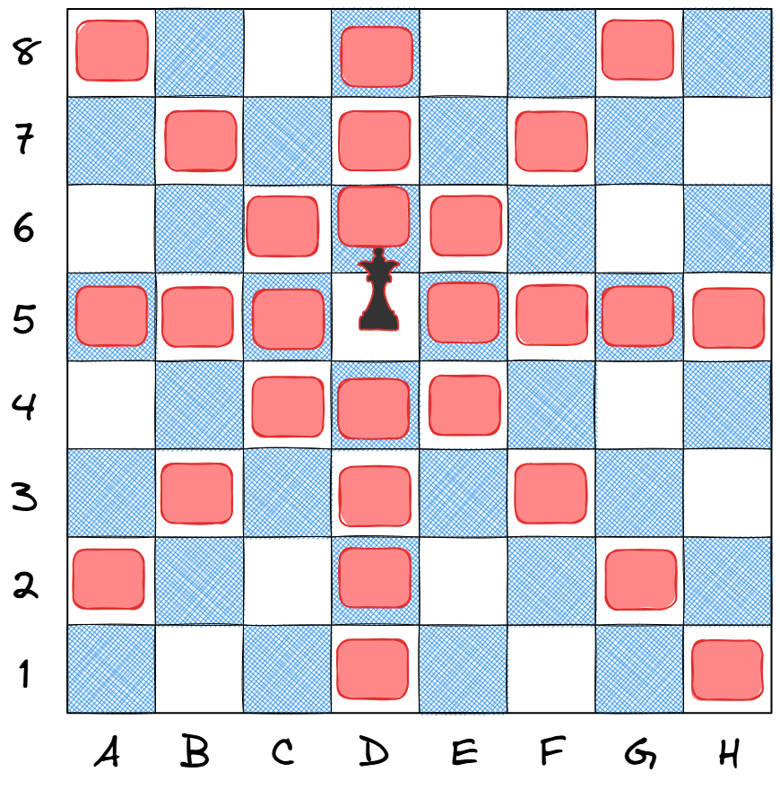
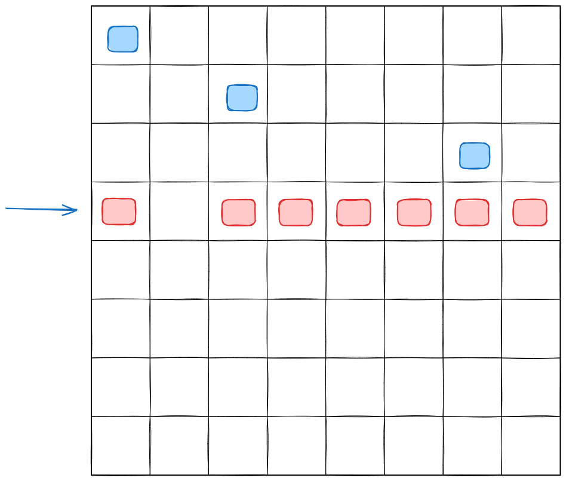
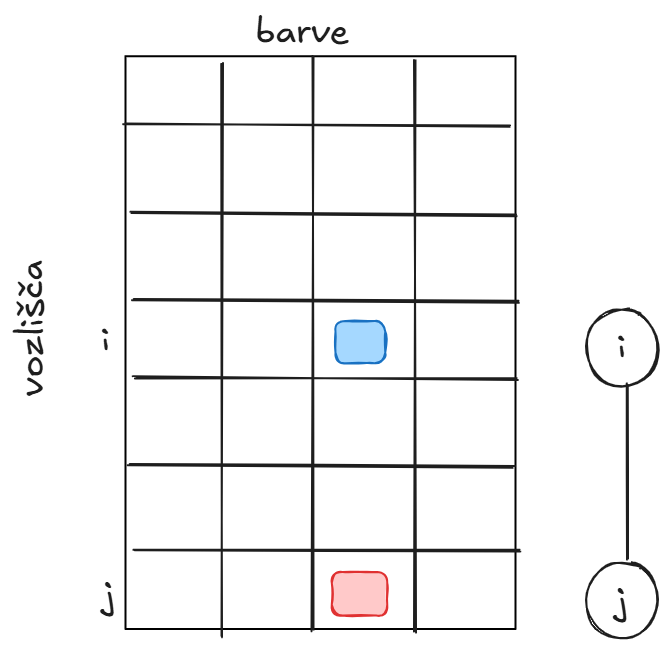

# Sestopanje

## Uroš Čibej
### 28.5. 2025


---
# Pregled

- permutacije
- sestopanje
- rezanje s pogledom nazaj
- rezanje s pogledom naprej

---
# Permutacije

- posebna vrsta terk
- vse kar smo zadnjič počeli (prefiltriramo)
-  $<<n^n$

---
# Generiranje permutacij

$$1,2,3,4$$

1234	2134	3124	4123
1243	2143	3142	4132
1324	2314	3214	4213
1342	2341	3241	4231
1423	2413	3412	4312
1432	2431	3421	4321

---
# Ideja

- vsak element je lahko prvi
- nadaljevanje so vse permutacije ostalih elementov

To lahko neposredno zapišemo v rekuzivno definicijo

---
# Implementacija
```python
def perm(lst):
    if len(lst) == 0:
        return [[]]
    else:
        result = []
        for i in range(len(lst)):
            rest = lst[:i] + lst[i+1:]
            for p in perm(rest):
                result.append([lst[i]] + p)
        return result
```

---
# Aplikacija ($N$ kraljic)


---
# Preverjanje

noben par kraljic ni v isti diagonali

Kaj velja za dve kraljici na isti diagonali?

---

# Implementacija
```python
def check_queens(perm):
    positions = list(enumerate(perm))  
    for i, j in positions:
        for k, l in positions:
            if i<k and (i+j == k+l or i-j == k-l):
                return False
    return True
```

---
# Sestopanje

- nočemo imeti seznama vseh kombinatoričnih objektov
- želimo samo sistematično generirati delne permutacije

---
# Primer


---
# Implementacija
```python
def perm2(lst, current=[]):
    if len(lst) == 0:
        print(current) # tukaj je celotna permutacija
        return 
    else:
        for i in range(len(lst)):
            rest = lst[:i] + lst[i+1:]
            perm2(rest, current+[lst[i]])        
```

---
# Rezanje (preverjanje nazaj)
- obhod drevesa lahko ustavimo že prej
- med obhodom sestavljamo delno permutacijo
- če ta ni veljavna, lahko takoj sestopimo
- s tem odrežemo ogromna poddrevesa


---
# Implementacija
```python
# osnovno rezanje (backward checking)
def Nqueens_bc(columns, current=[]):
    if len(columns) == 0:
        if valid(current):
            print(current)
    else:
        if not valid(current):
            return 0
        for i in range(len(columns)):
            rest = columns[:i] + columns[i+1:]
            Nqueens_bc(rest, current+[columns[i]])
    return count       
```

---
# Rezanje (preverjanje naprej)


---
# Matrika kompatibilnosti


---
# Postavitev omejitev
```python
def set_non_comp(compatibility, i, j):
    n = len(compatibility)
    for k in range(n):
        compatibility[i][k] = False
        compatibility[k][j] = False
    for d in range(-n+1, n):
        if 0 <= i + d < n and 0 <= j + d < n:
            compatibility[i + d][j + d] = False
        if 0 <= i + d < n and 0 <= j - d < n:
            compatibility[i + d][j - d] = False
```
---
# Implementacija
```python
def Nqueens_fc(i,n,compatibility):
    if i>= n:
        print(compatibility)
    else:
        for j in range(n):
            if compatibility[i][j]:
                # kopiramo matriko
                new_compatibility = [row[:] for row in compatibility]  
                set_non_comp(new_compatibility, i, j)
                new_compatibility[i][j] = True
                Nqueens_fc(i + 1, n, new_compatibility)

```

---
# Barvanje grafov

- Ali znamo zasnovati sestopanje?
- Preverjanje nazaj
- Preverjanje naprej

---
$$\phi: V \to \{0,\ldots, k-1 \}$$

---
# Matrika kompatibilnosti


