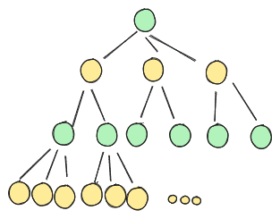
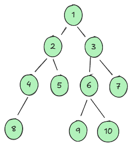

# O drevesih in še čem...

1. Podano imate popolno 3-2-tiško drevo. To so drevesa, kjer so vozlišča na sodih globinah stopnje 3, vozlišča na lihih globinah pa stopnje 2. Ker je to popolno drevo, so vse veje enako dolge, vsa vozlišča (razen listov) pa imajo vse sinove.


Preučili bomo, koliko vozlišč ima tako drevo, če je njegova globina n.
   
a) Zapišite koliko vozlišč ima tako drevo pri n=0, 1, 2, 3, 4, 5

b) Zapišite rekurzivno formulo za število vozlišč na globini i (v odvisnosti od prejšnje globine)

c) Zapišite formulo za izračun števila vozlišč v takem drevesu v odvisnost od globine.

2. Naredimo obhod spodnjega drevesa, vendar tokrat na pomoč pokličemo dve podatkovni strukturi: sklad in vrsta.



    Dodaj koren drevesa v strukturo
    Ponavljaj dokler struktura ni prazna:
        vzemi vozlišče iz strukture
        dodaj vse sinove tega vozlišča v strukturo
Zapišite sled izvajanja tega postopka:

a) če je uporabljena podatkovna struktura sklad

b) če je uporabljena podatkovna struktura vrsta


3. Podan imate izraz:

    (5+7x9)-(2+6x15)
Napišite ta izraz kot drevo.

4. 
Podan imate razred, ki predstavlja aritmetične izraze
```python
class ExpressionTreeNode:
    def __init__(self, value):
        self.value = value
        self.left = None
        self.right = None
    
    def __str__(self):
        if self.left and self.right:
            return f"({str(self.left)} {self.value} {str(node.right)})"
        else:
            return str(node.value)
    
    def evaluate(self):
        TODO

def make_tree(expr):
    TODO
```

a) napišite funkcijo make_tree(expr), ki za podani izraz v postfiksni obliki (tisto kar smo računali na enih od prejšnjih vaj) zgradi drevo. Tudi tukaj uporabite sklad, primer gradnje pa bomo naredili na tablo.

b) v razred ExpressionTreeNode dodajte funkcijo evaluate, ki vrne vrednost celotnega izraza.