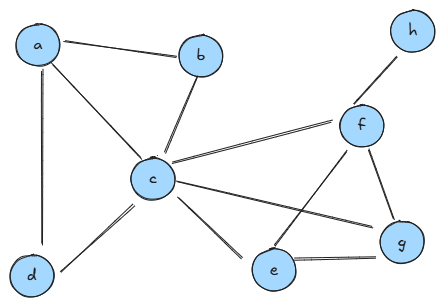

# Grafi - uvod

1. Podan imate graph na sliki:



a) koliko je povprečna stopnja vozlišča?

b) koliko je najdaljša enostavna pot v tem grafu?

c) zapišite zaporedje obiskanih vozlišč s preiskovanjem v globino, če začnete v vozlišču g. Če začnete v d?


2. Na področju, ki vas zanima, se z njim ukvarjate kot hobi, ali vam je zgolj zabavno, zgradite graf. Graf naj ima vsaj 10 vozlišč in naj bo povezan. Narišite ga, povejte koliko ima povezav, katero vozlišče ima največjo stopnjo in koliko je najdaljša pot med dvema vozliščema v tem grafu.

3. Shranite zgrajeni graf v tekstovno datoteko in ga preberite v razred GraphAL. 

4. V razred GraphAM dodajte funkcijo

```python
def toAL(self)
```
ki pretvori graf v predstavitev s seznamom sosednosti.

5. Podobno, v razred GraphAL dodajte funkcijo:
```python
def toAM(self)
```
ki pretvori graf v predstavitev z matriko sosednosti.