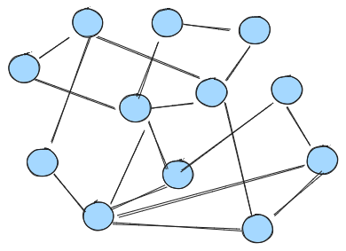
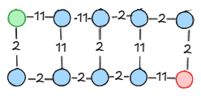

## Grafi - najkrajše poti

### Naloga 1.

Podan imate graf:



a) Zamislite si neko oštevilčenje vozlišč.

b) Izberite si eno vozlišče in iz njega naredite BFS in DFS obhod.

c) Narišite BFS obhod kot drevo in za vsako vozlišče zapišite razdaljo do njega od izbranega vozlišča


### Naloga 2.
Radi bi potegnili vodovod med dvema lokacijama. Celoten zemljevid je predstavljen kot tabela celih števil, povezali pa bi radi lokacijo v zgornjem levem kotu in lokacijo v spodnjem desnem kotu.

Za povezavo dveh sosednjih lokacij morate plačati ceno, ki jo zahteva prva lokacija in ceno, ki jo zahteva druga lokacija (denimo ceno gradbenega dovoljenja neki upravni enoti).

Zemljevid določa ceno, ki jo zaračunava posamezna lokacija, npr.
```
4 6 2 1 3
0 2 2 8 1
1 1 9 1 1
8 9 4 3 2
2 9 2 1 1
```

Zemljevid je torej predstavljen kot tabela lokacij, vsaka številka predstavlja lokacijo, vrednost števila pa je cena za gradnjo na tej lokaciji. Povezujete lahko samo lokacije, ki so ena nad drugo, ali ena ob drugi (povežete lahko levo, desno, nad ali pod neko lokacijo)

Za kakšno ceno lahko zgradimo vodovod med začetno in končno lokacijo?

Ta problem bomo pretvorili v problem nad grafi, podobno kot smo labirinte na predavanjih. Vsaka lokacija je vozlišče grafa, povezave pa naredimo med sosednjimi lokacijami, cena pa je vsota cen stroškov obeh lokacij.
**Primer**
Zemljevid
```
1 10 1 1 1
1 1 1 10 1
```
se spremeni v graf:




a) Napišite si svoj manjši primer, na list narišite graf in poiščite najcenejšo pot (po občutku). Nato odsimulirajte Dijkstrov algoritem na tem grafu.

b) Napišite funkcijo `map_to_graph(zemljevid)`, ki pretvori zemljevid v graf, kjer bo najkrajša pot prestavljala najugodnejšo ceno izgradnje vodovoda. 

c) Napišite funkcijo `show_path(zemljevid, paths)`, ki iz poti dobljenih z Dijkstrovim algoritmom prikaže optimalno pot izgradnje. To preprosto naredi tako, da na lokaciji zapiše * namesto števila. Na zgoraj podanem primeru bi bil zapis:

```
* 10 * * *
* * * 10 *
```

d*) Napišite podobno funkcijo pretvorbe zemljevida v graf, če bi dovolili tudi gradnjo po diagonalah. 


