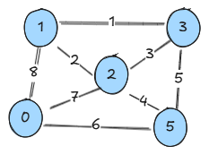
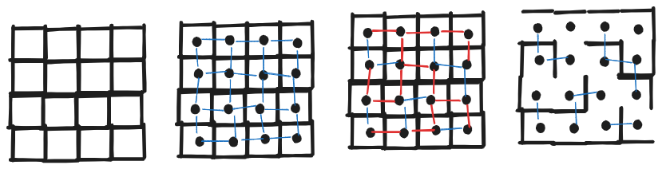

# Najcenejša vpeta drevesa

### Naloga 1



- s Kruskalovim algoritmom poiščite najcenejše vpeto drevo v tem grafu
- najštejte vse možne prereze tega grafa in za vsak prerez podajte najcenejšo povezavo


### Naloga 2

S pomočjo kruskalovega algoritma bomo gradili labirinte. Shematski prikaz grajenja je prikazan na spodnjih štirih slikah, podrobnosti pa bomo podali na tablo.




Implementirajte funkcijo `create_maze(n,m)`, ki ustvari in izriše naključni labirint. Labirint ima vhod skrajno levo zgoraj, izhod pa skrajno desno spodaj. 

Primer izhoda za `create_maze(6,6)` je:

```
#############
  #     #   #
# ##### # # #
#       # # #
##### # # ###
#     #     #
### ##### ###
# #     #   #
# ### ### # #
#   # #   # #
# # ### #####
# #          
#############
```