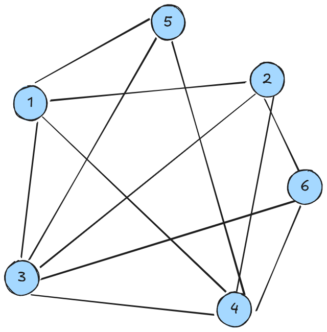

# Kombinatorika

### 1. Pobarvajmo ga
Najmanj koliko barv potrebujemo za obarvanje vozlišč tega grafa, da nobena povezava ne bo imela krajišč v isti barvi.

### 2. Razporeditev učencev po tematskih skupinah

Učiteljica želi razdeliti $N$ učencev v $K$ tematskih skupin (npr. "Raziskovalci vesolja", "Mladi arheologi", "Kuharski mojstri", itd.). Vsak učenec je izrazil željo, v katere skupine bi rad bil uvrščen, in tudi, katere skupine mu niso preveč všeč. Poleg tega ima vsaka tematska skupina omejeno število mest. Učiteljica želi razporediti vse učence v skupine tako, da čim več učencev dobi eno izmed svojih želenih skupin.

Poiščite razporeditev učencev v skupine (tj. za vsakega učenca določite eno skupino), ki izpolnjuje naslednje pogoje in cilje:

1. Vsak učenec mora biti dodeljen natanko eni skupini.
2. Nobena skupina ne sme preseči svoje kapacitete.
3. Cilj: Maksimizirati število učencev, ki so dodeljeni eni izmed svojih želenih skupin.
4. Dodatni cilj (zahtevnejši): Med razporeditvami, ki maksimizirajo število zadovoljenih želja, poiščite tisto, ki minimizira število učencev, dodeljenih v "ne-želene" skupine.

Vhod imate podan v datoteki `v11-skupine.txt` med viri.